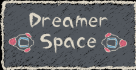
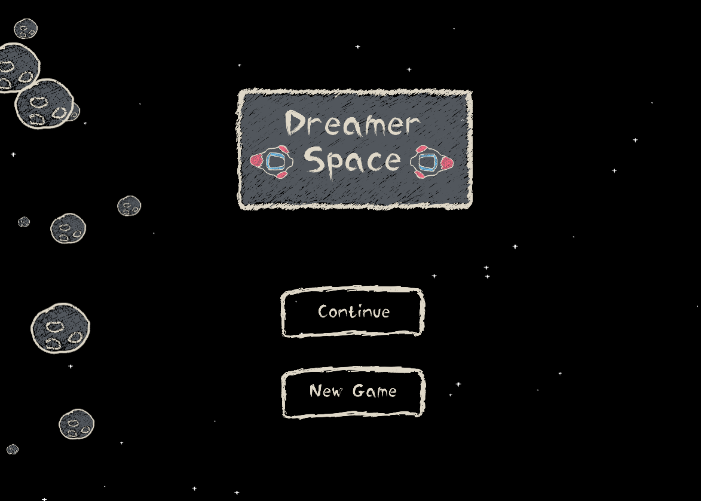

# 🌌 DreamerSpace



## 🚀 Description

**DreamerSpace** is a **2D endless space adventure game** where players control a spaceship, explore the universe, and collect as many points as possible.

Move your ship by clicking and dragging, aim toward your destination, and travel through space.  
Crash into constellations to move to the next world and keep your journey going as long as you can.

---

## 🎮 Game Features

- 2D endless space adventure gameplay  
- Click & drag ship movement  
- Score-based progression    
- Increasing difficulty over time  

---

## ⚙️ How to Setup

Make sure you have **Node.js** installed on your machine.

### 1️⃣ Install dependencies
```bash
npm install
```

```bash
npm start
```

### 1️⃣ Images 




